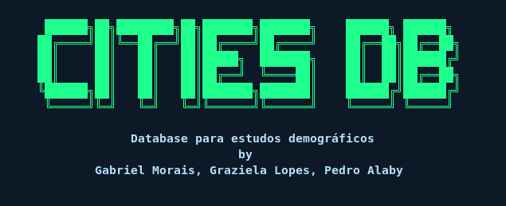

# Sistema de Gerenciamento de Cidades - Projeto de Computação




Este projeto tem como objetivo criar uma interface de linha de comando (CLI) para manipular e visualizar dados demográficos de cidades. Ele foi desenvolvido como parte do curso de Ciência da Computação da Universidade Paulista pelos alunos Gabriel Morais, Graziela Lopes e Pedro Alaby.

## Funcionalidades

O sistema permite realizar diversas operações na base de dados de cidades, tais como:

- Visualizar todas as cidades, metrópoles ou cidades com área superior a 1000 km².
- Calcular e exibir estatísticas demográficas médias (população, área e densidade demográfica).
- Ordenar as cidades por nome, área, população ou índice.
- Buscar cidades pelo nome.
- Adicionar novas cidades à base de dados.
- Limpar a base de dados, removendo todas as cidades.
  
## Estrutura do Projeto

- **main.py**: Arquivo principal do projeto que contém a interface de linha de comando e os métodos principais para visualização e manipulação dos dados.
- **localPackage.py**: Biblioteca local com funções auxiliares, como a formatação de texto e a manipulação da interface do usuário.
- **db/city_db.json**: Arquivo JSON que serve como banco de dados das cidades.
- **requirements.txt**: Arquivo para instalação das dependências.

## Formato do Arquivo JSON

O arquivo `city_db.json` possui o seguinte formato:

```json
{
  "Cidades": [
    {
      "Cidade": "<Nome da Cidade>",
      "Área": <Área em km²>,
      "População": <População>
    }
  ]
}
```

## Instalação 

Clone o repositório para sua máquina local

 ```bash
 git clone https://github.com/alabypedro/aps2
```

Instale as dependências

```bash
python install -r requirements.txt
```

## Uso

Execute o arquivo `main.py`

```bash
python main.py
```
### Menu Principal

**[1] Acessar base de dados**: Permite visualizar e organizar as cidades de acordo com as opções disponíveis.  
**[2] Inserir uma nova cidade**: Adiciona uma nova cidade ao banco de dados.  
**[3] Limpar a base de dados**: Limpa o banco de dados, apagando todas as cidades.  
**[s] Sair**: Encerra o sistema.

### Exemplo de Operações
Após acessar o menu principal, você poderá selecionar várias opções para manipular os dados de cidades. As principais funcionalidades são:

- Visualizar e ordenar todas as cidades ou categorias específicas (metrópoles e grandes cidades).  
- Inserir uma nova cidade, fornecendo nome, área e população.  
- Buscar uma cidade específica pelo nome.  
- Visualizar estatísticas como população média, área média e densidade demográfica. 

## Informações para DEVs
### Estrutura de Classes e Funções
#### Classe DbHandler
A classe `DbHandler` é responsável por manipular a base de dados, permitindo operações como visualização, ordenação e cálculo de estatísticas.

**Principais métodos:**
- print_cities(): Exibe todas as cidades da base de dados.  
- print_metropolis(): Exibe apenas as metrópoles (cidades com população > 1 milhão).
- print_largeCities(): Exibe cidades com área maior que 1000 km².
- print_average_statistics(current_option): Calcula e exibe as estatísticas médias com base na opção selecionada.
- handle_sort_options(current_option, user_input='4'): Permite ordenar a lista de - cidades de acordo com a preferência do usuário.
- find_city(search_string): Realiza busca de cidades pelo nome.

#### Funções Auxiliares
- read_json_to_panda(): Lê o arquivo JSON e carrega os dados no formato Pandas.
- update_json_from_panda(data): Atualiza o arquivo JSON a partir de um DataFrame do Pandas.
- Clean_DB(): Limpa o arquivo JSON e reconfigura o layout padrão.
- add_city(name, area, pop): Adiciona uma nova cidade ao arquivo JSON.

## Observações
Este sistema foi projetado para fins de estudo e simulação em ambiente controlado. Para maiores desenvolvimentos ou implementações em ambientes de produção, recomenda-se a realização de ajustes adicionais, incluindo a validação de entradas e a implementação de medidas de segurança apropriadas.

## Contato
Desenvolvido por:

- Gabriel Morais - gabrielmorais98@gmail.com
- Graziela Lopes - grazielalinda444@gmail.com
- Pedro Alaby - pedroalaby@gmail.com
